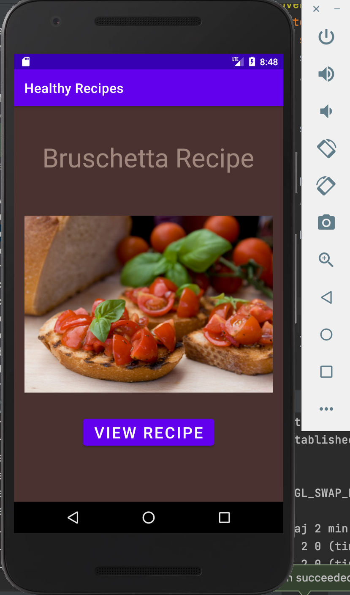
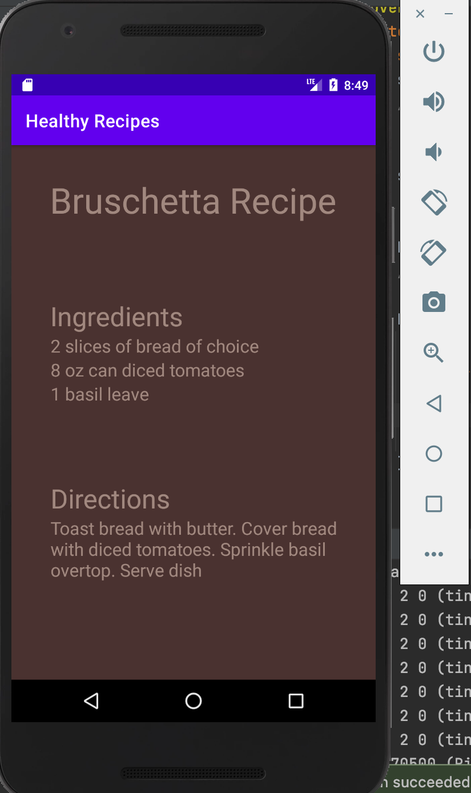
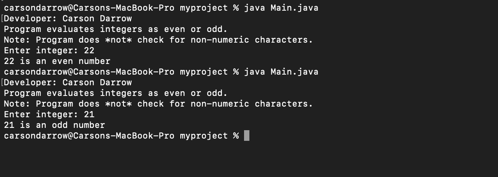
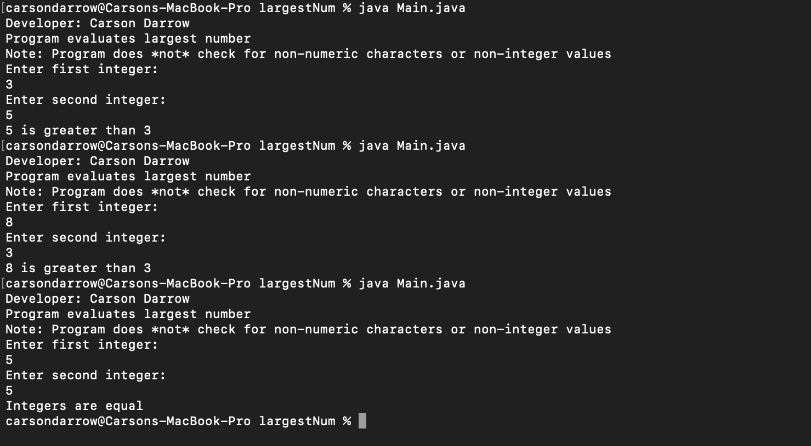
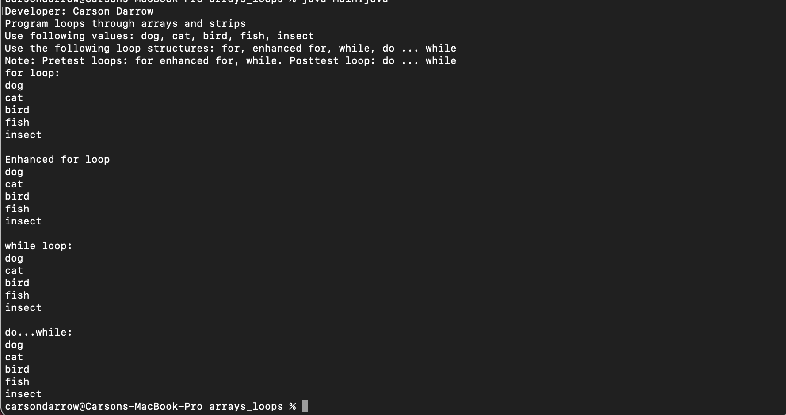

> **NOTE:** This README.md file should be placed at the **root of each of your repos directories.**
>
>Also, this file **must** use Markdown syntax, and provide project documentation as per below--otherwise, points **will** be deducted.
>

# LIs4381

## Carson Darrow

### Assignment 2 Requirements:

Three Parts:

1. Create mobile recipe app using Android Srudio
2. Make recipe app different in some way
3. Chapter Questions (Chs 3 4)

#### README.md file should include the following items:

* Course title, your name, assignment requirements, as per A1
* Screenshot of running application’s first user interface
* Screenshot of running application’s second user interface
* Bitbucket repo links

> This is a blockquote.
> 
> This is the second paragraph in the blockquote.
>

#### Assignment Screenshots:

### Screenshot Recipe App:

| Recipe App #1 | Recipe App #2 |
| -------------- | --------------|
|  ) |  |

### Skillset #1 - #3:

| Skillset #1 | Skillset #2 | Skillset #3 |
| -------------- | --------------| -------------- |
|  |  |  |

#### Tutorial Links:

*Bitbucket Tutorial - Station Locations:*
[A1 Bitbucket Station Locations Tutorial Link](https://bitbucket.org/cbd19a/bitbucketstationlocations/ "Bitbucket Station Locations")

*Tutorial: Request to update a teammate's repository:*
[A1 My Team Quotes Tutorial Link](https://bitbucket.org/username/myteamquotes/ "My Team Quotes Tutorial")