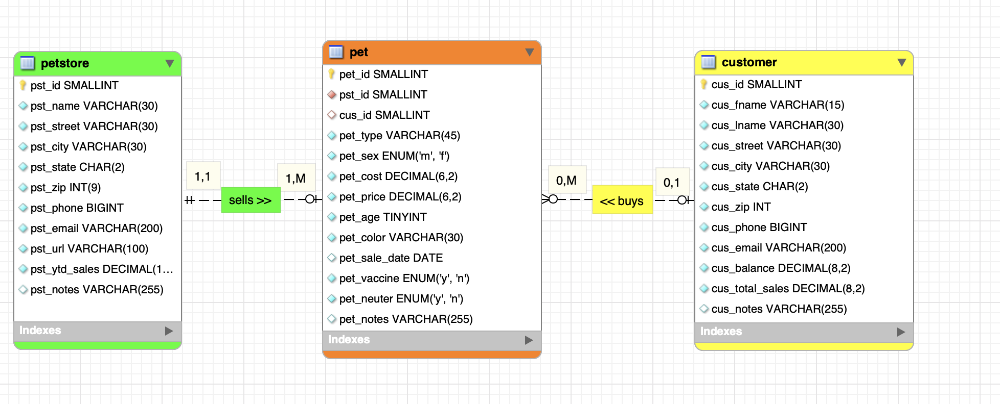
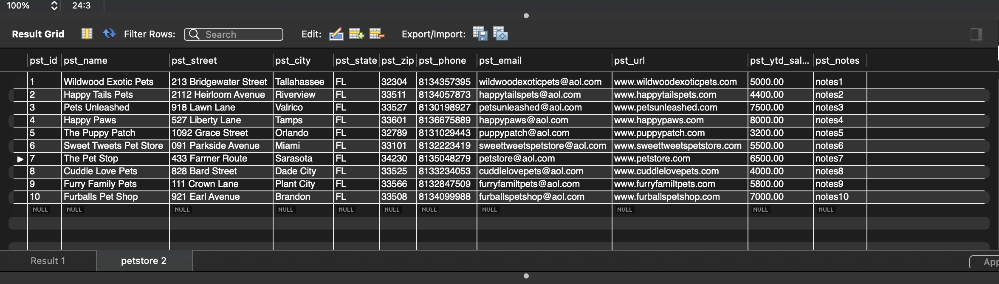
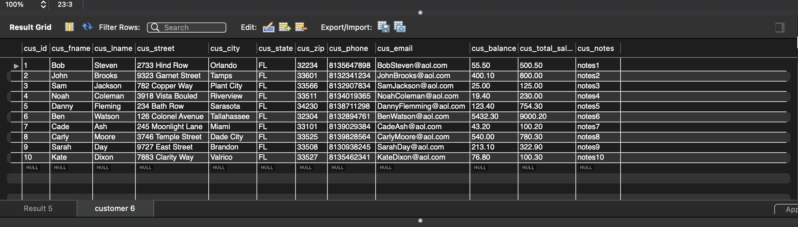
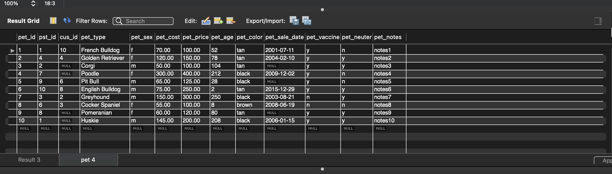
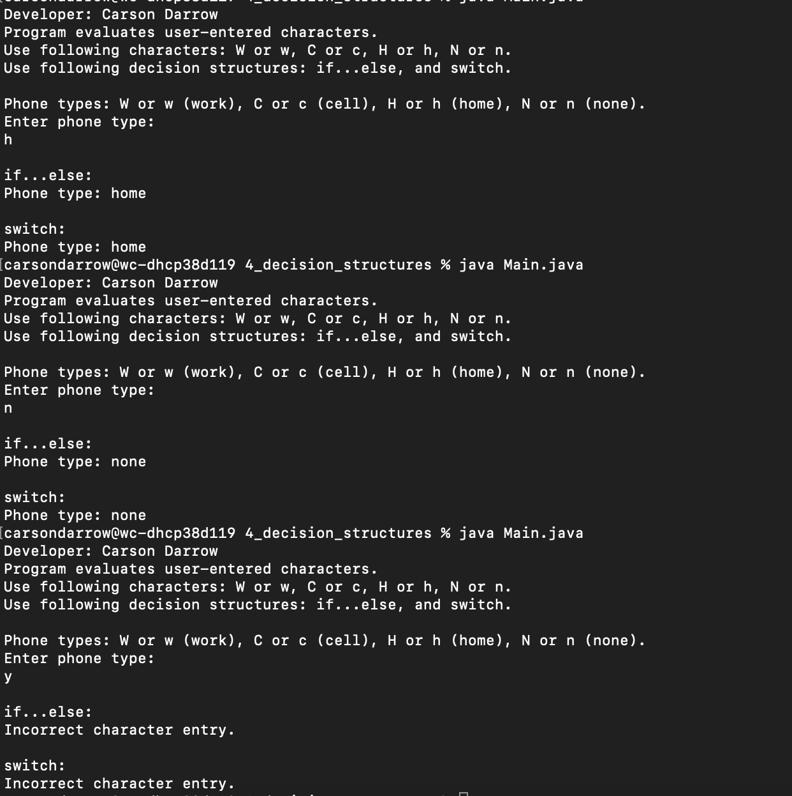
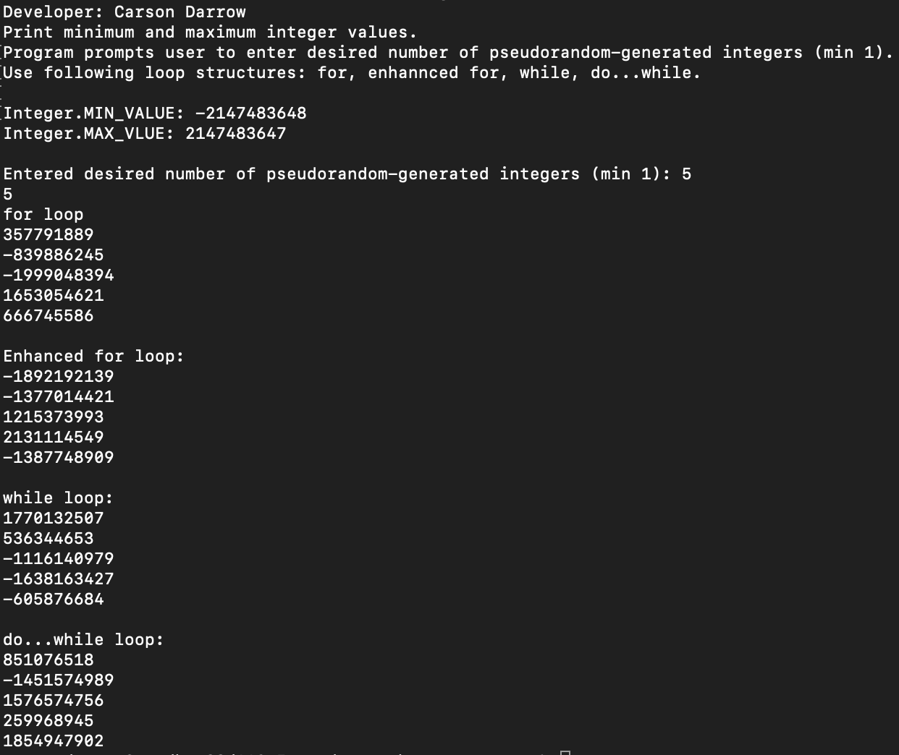
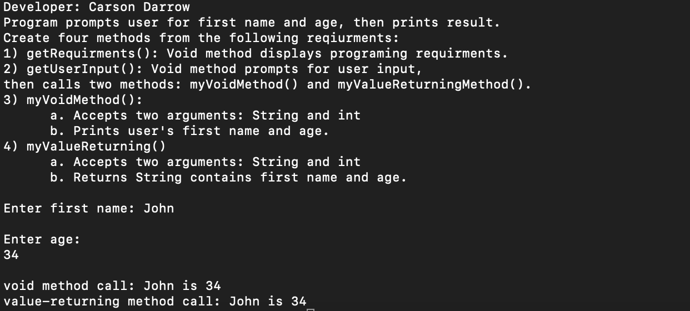

> **NOTE:** This README.md file should be placed at the **root of each of your repos directories.**
>
>Also, this file **must** use Markdown syntax, and provide project documentation as per below--otherwise, points **will** be deducted.
>

# LIs4381

## Carson Darrow

### Assignment 3 Requirements:

Three Parts:

1. Create a database 
2. Create an ERD with 10 unique records 
3. Design an applications that user inputs how many tickets they want and get a price 

#### README.md file should include the following items:

* Screenshot of ERD
* Screenshot of running application's opening user interface
* Screenshot of running application's processing user input
* Screenshot of 10 records for each table 

* Link to a3.mwb
[a3.mwb](docs/a3.mwb)

* Link to a3.sql
[a3.sql](docs/a3.sql)
	

> This is a blockquote.
> 
> This is the second paragraph in the blockquote.
>

#### ERD:

#### Application  Running:

### Screenshot:

### Pet Store:

### Customer: 

#### Pet:

### Skillset #4 - #6:

| Skillset #4 | Skillset #5 | Skillset #6 |
| -------------- | --------------| --------------- |
|  |  |  |

#### Tutorial Links:

*Bitbucket Tutorial - Station Locations:*
[A1 Bitbucket Station Locations Tutorial Link](https://bitbucket.org/cbd19a/bitbucketstationlocations/ "Bitbucket Station Locations")

*Tutorial: Request to update a teammate's repository:*
[A1 My Team Quotes Tutorial Link](https://bitbucket.org/username/myteamquotes/ "My Team Quotes Tutorial")

