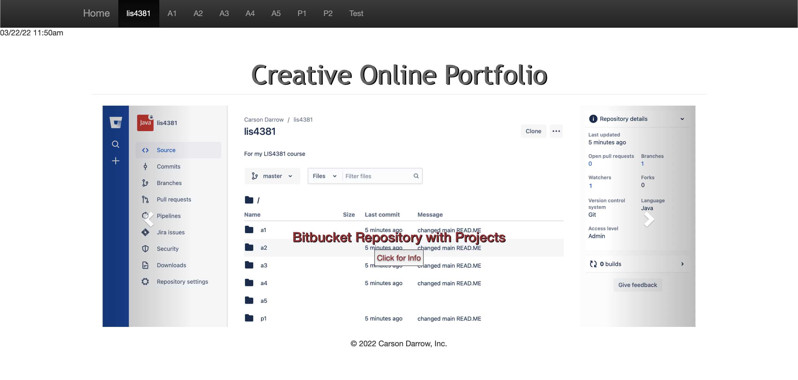
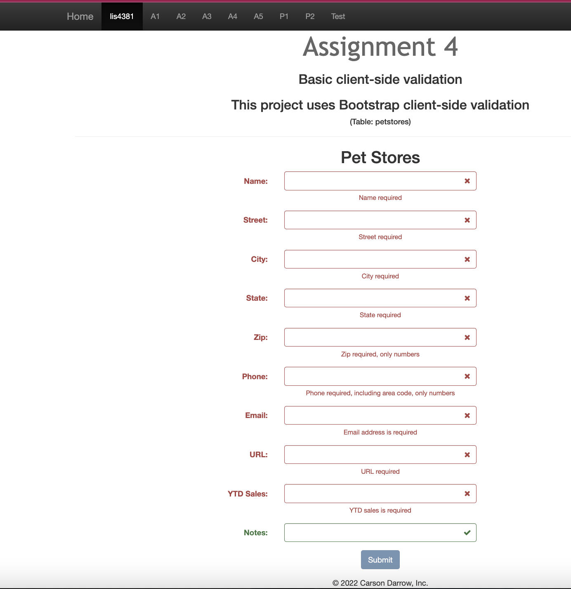
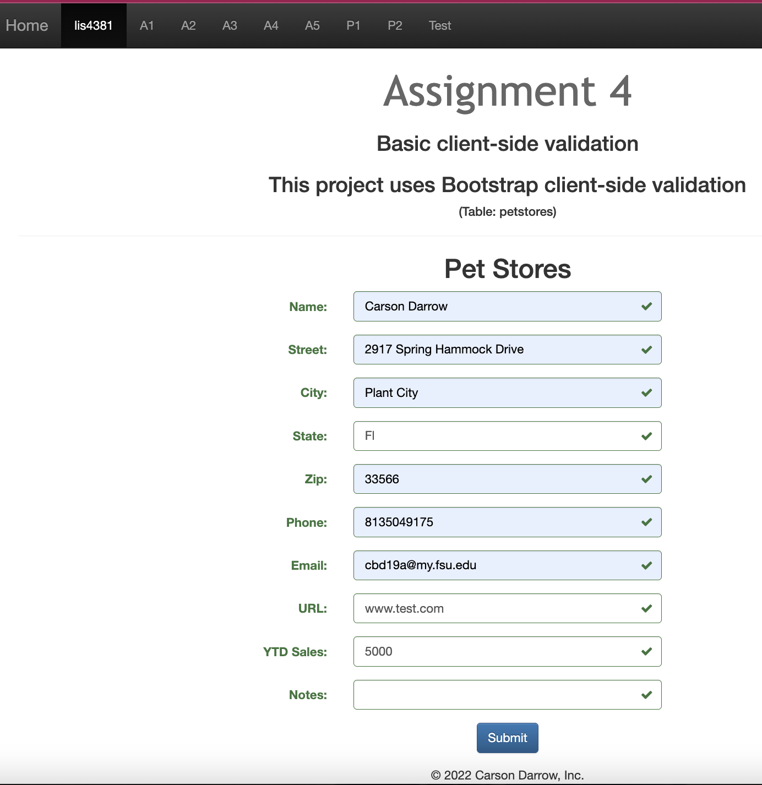

> **NOTE:** This README.md file should be placed at the **root of each of your repos directories.**
>
>Also, this file **must** use Markdown syntax, and provide project documentation as per below--otherwise, points **will** be deducted.
>

# LIs4381

## Carson Darrow

### Assignment 4 Requirements:

Three Parts:

1. Create an online portfolio web app
2. Make sure all links are functional
3. Provide screenshots of online portfolio

#### README.md file should include the following items:

* Screenshot of online portfolio main page
* Screenshot of failed validation
* Screenshot of passed validation
* Links to local lis4381 web app: a) [Online Portfolio](http://localhost:8080/repos/lis4381/index.php)

> This is a blockquote.
> 
> This is the second paragraph in the blockquote.
>

#### Assignment Screenshots :

#### Application  Running:

### Screenshot:

### Pet Store:

### Customer: 

#### Pet:

### Skillset #4 - #6:

| Skillset #4 | Skillset #5 | Skillset #6 |
| -------------- | --------------| --------------- |
|  |  |  |

#### Tutorial Links:

*Bitbucket Tutorial - Station Locations:*
[A1 Bitbucket Station Locations Tutorial Link](https://bitbucket.org/cbd19a/bitbucketstationlocations/ "Bitbucket Station Locations")

*Tutorial: Request to update a teammate's repository:*
[A1 My Team Quotes Tutorial Link](https://bitbucket.org/username/myteamquotes/ "My Team Quotes Tutorial")

