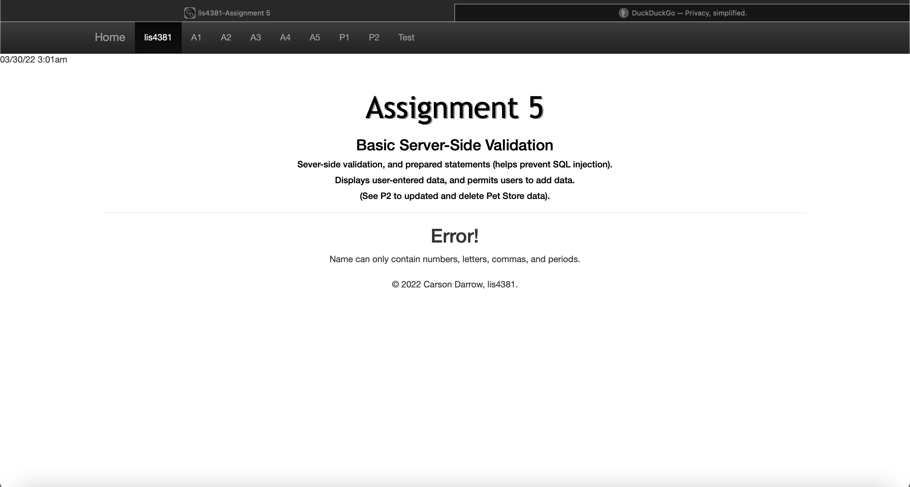
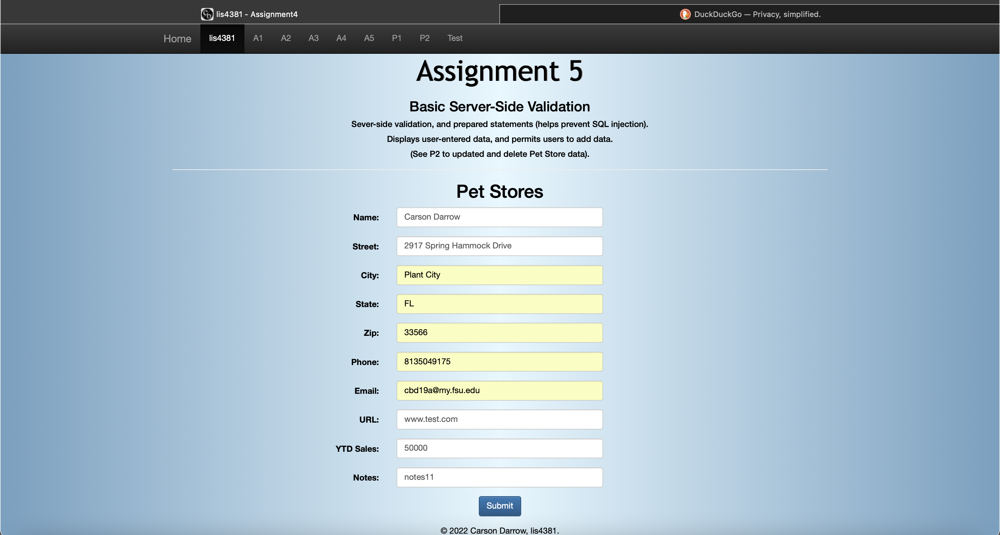
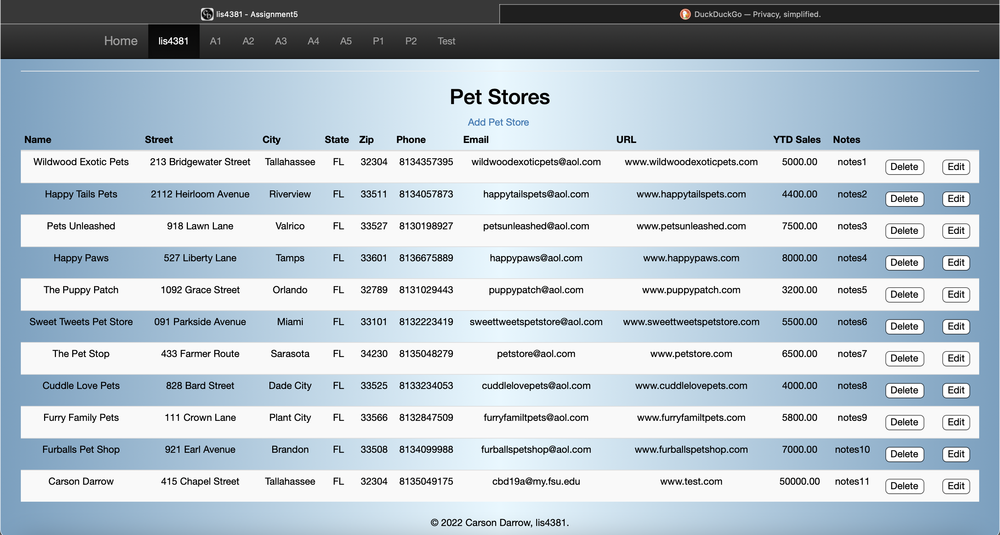
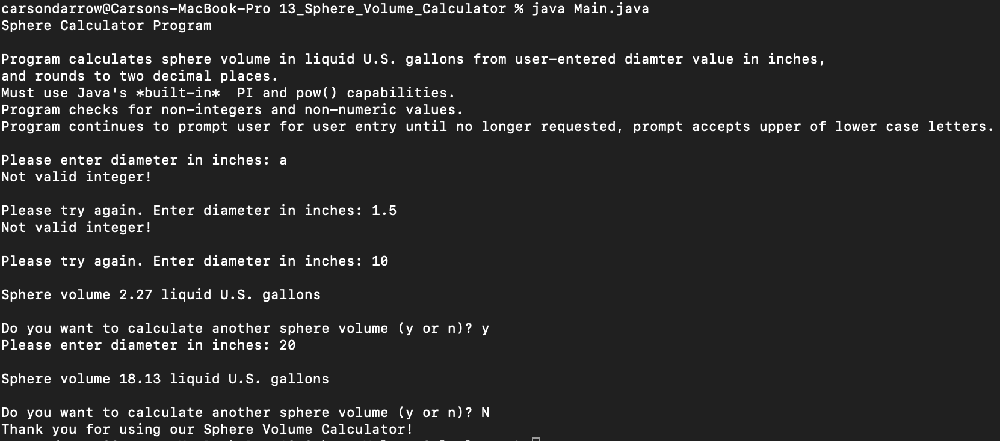
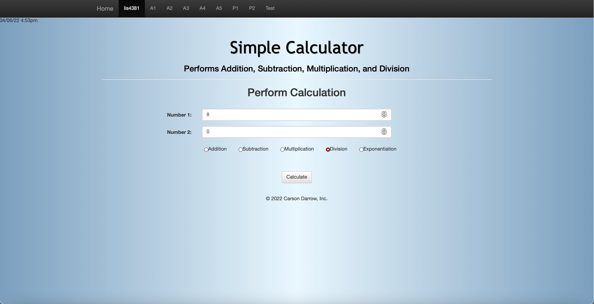
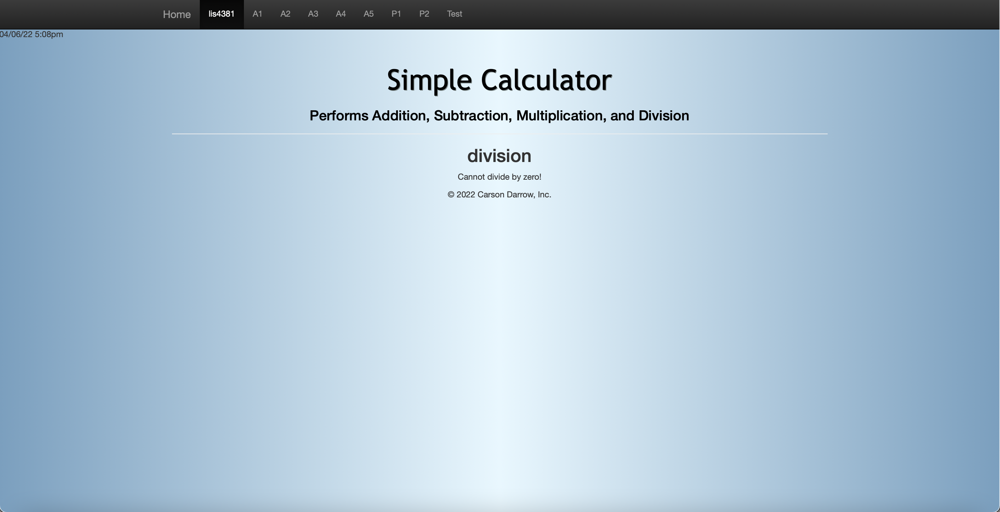
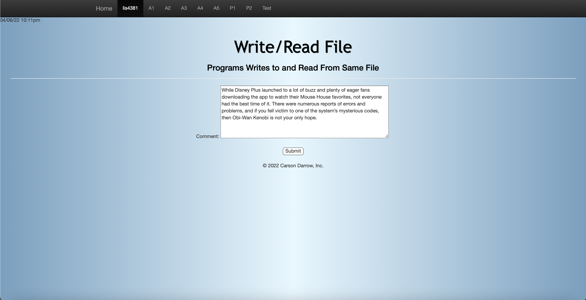
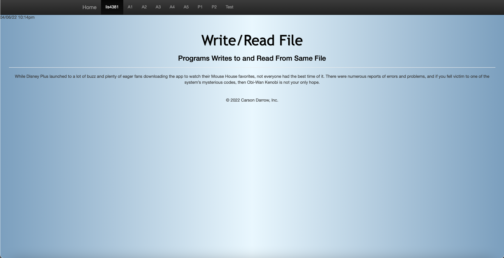

> **NOTE:** This README.md file should be placed at the **root of each of your repos directories.**
>
>Also, this file **must** use Markdown syntax, and provide project documentation as per below--otherwise, points **will** be deducted.
>

# LIs4381

## Carson Darrow

### Assignment 5 Requirements:

Three Parts:

1. Develop server-side validation of a form in php
2. Develop a form that adds data into a database
3. Chapter Questions (chs. 11, 12, & 19)
4. Skill Set 13-15

#### README.md file should include the following items:

* Screenshot of index.php for the data in petstore
* Screenshot of server-side data validation
* Links to local lis4381 web app: a) [Online Portfolio](http://localhost:8080/repos/lis4381/a5/index.php)

> This is a blockquote.
> 
> This is the second paragraph in the blockquote.
>

## Assignment Screenshots :

### Failed Validation Page 1

### Failed Validation Page 2

### Passed Validation Page 1

### Passed Validation Page 2

### Skillset #13 - #15:

| Skillset #13 |
| -------------- |
|  |

| Skillset #14 |
| -------------- |
 | 
 |
 | 
 | 

| Skillset #15 |
| -------------- |
 |
 |

#### Tutorial Links:

*Bitbucket Tutorial - Station Locations:*
[A1 Bitbucket Station Locations Tutorial Link](https://bitbucket.org/cbd19a/bitbucketstationlocations/ "Bitbucket Station Locations")

*Tutorial: Request to update a teammate's repository:*
[A1 My Team Quotes Tutorial Link](https://bitbucket.org/username/myteamquotes/ "My Team Quotes Tutorial")

