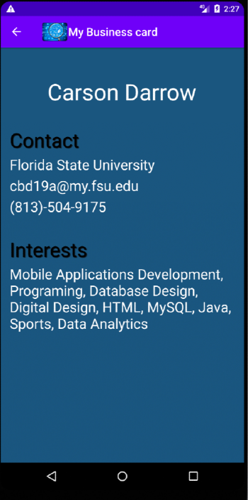
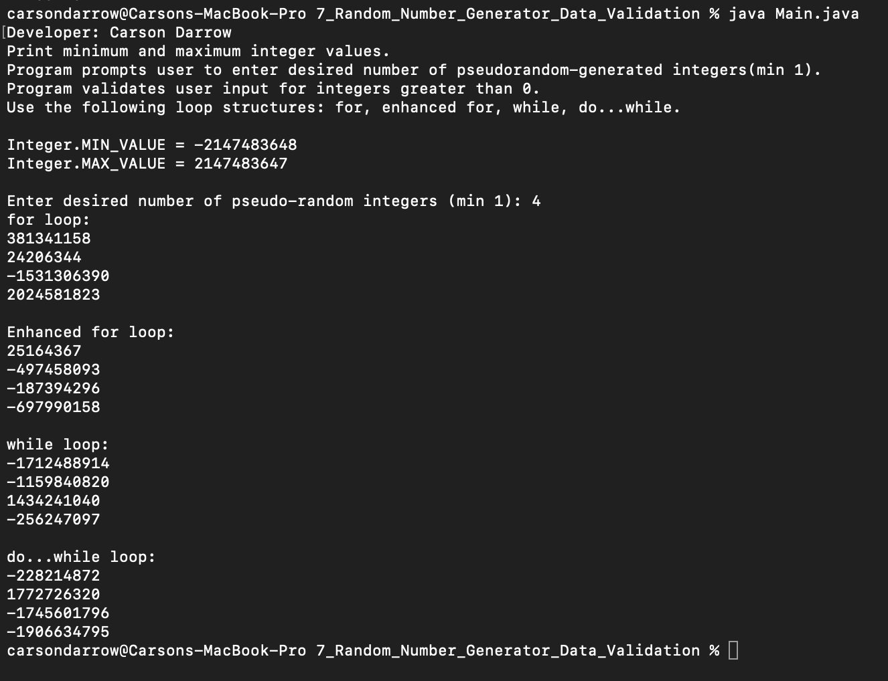
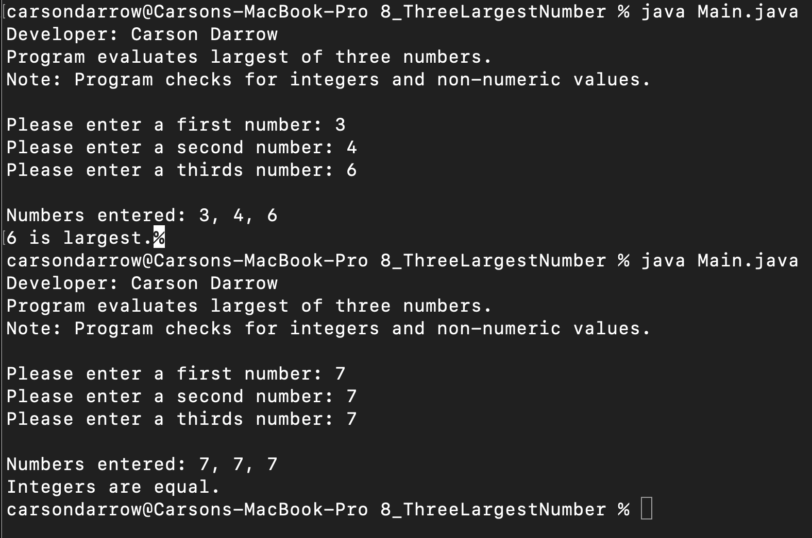
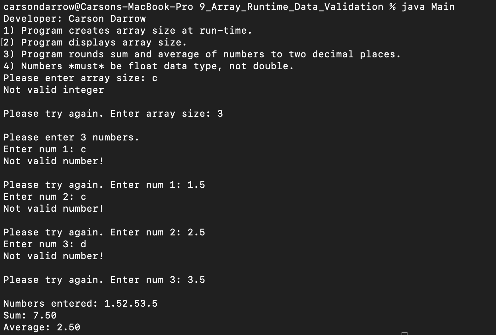

> **NOTE:** This README.md file should be placed at the **root of each of your repos directories.**
>
>Also, this file **must** use Markdown syntax, and provide project documentation as per below--otherwise, points **will** be deducted.
>

# LIs4381

## Carson Darrow 

### Assignment  Requirements:

Three Parts:

1. Create My Own Business Card
2. Develop Understanding on How to Navigate Multiple Pages
3. Chapter Questions (Chs 7, 8)

#### README.md file should include the following items:

* Course title, Name, Assignment Requirements
* Screenshot of running application’s first user interface
* Screenshot of running application’s second user interface

> This is a blockquote.
> 
> This is the second paragraph in the blockquote.

#### Assignment Screenshots:

*Video of Business Card running*:

### Screenshot of Business Card running:

| Business Card Front | Business Card Info |
| -------------- | --------------|
|  |  |

| Skillset 7 | Skillset 8 | Skillset 9 |
| -------------- | --------------| ------------- |
|  |  |  |

