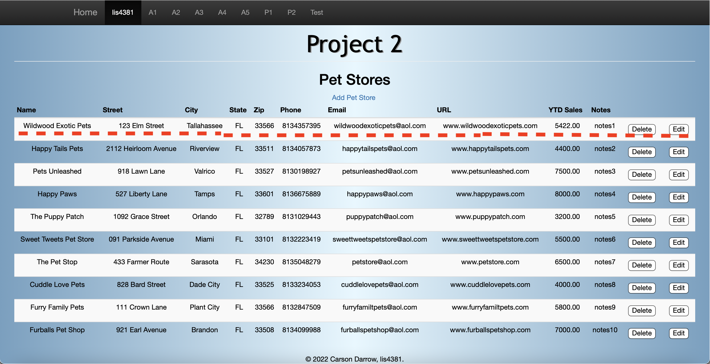

> **NOTE:** This README.md file should be placed at the **root of each of your repos directories.**
>
>Also, this file **must** use Markdown syntax, and provide project documentation as per below--otherwise, points **will** be deducted.
>

# LIs4381

## Carson Darrow

### Project 2 Requirements:

Four Parts:

1. Add edit functionality to the pet store database
2. Add delete functionality to the pet store database
3. Create an RSS feed
4. Chapter Questions (chs.13 & 14)

#### README.md file should include the following items:

* Course title, Your name, Assignment Requirements
* Screenshot of pet store database running on a browser
* Screenshot of editing a record in the pet store database
* Screenshot of the RSS feed

> This is a blockquote.
> 
> This is the second paragraph in the blockquote.

#### Assignment Screenshots:

### Index.php

### Edit Petstore 

### Failed Validation

### Passed Validation 

### Delete Record Prompt 

### Successful Delete Record 

### RSS Feed

#### Tutorial Links:

*Bitbucket Tutorial - Station Locations:*
[A1 Bitbucket Station Locations Tutorial Link](https://bitbucket.org/cbd19a/bitbucketstationlocations/ "Bitbucket Station Locations")

*Tutorial: Request to update a teammate's repository:*
[A1 My Team Quotes Tutorial Link](https://bitbucket.org/username/myteamquotes/ "My Team Quotes Tutorial")

